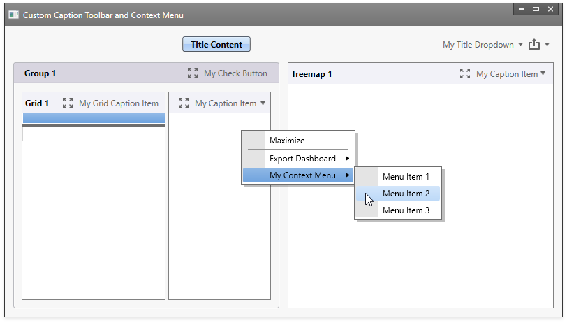

<!-- default badges list -->

<!-- default badges end -->

# Dashboard for WPF - How to Customize the Item's Caption and Context Menu

This example demonstrates how to apply the [CaptionCustomizationsTemplate](https://docs.devexpress.com/Dashboard/DevExpress.DashboardWpf.DashboardLayoutItem.CaptionCustomizationsTemplate) and [ContextMenuCustomizationsTemplate](https://docs.devexpress.com/WPF/DevExpress.Xpf.Docking.BaseLayoutItem.ContextMenuCustomizationsTemplate) templates to customize the caption toolbar and context menu in the WPF Dashboard control.

<!-- default file list -->
## Files to look at

* [MainWindow.xaml](./CS/WpfDashboardCustomCaptionMenu/MainWindow.xaml) (VB: [MainWindow.xaml](./VB/WpfDashboardCustomCaptionMenu/MainWindow.xaml))
<!-- default file list end -->

The following properties are used:
- [DashboardControl.TitleContent](https://docs.devexpress.com/Dashboard/DevExpress.DashboardWpf.DashboardControl.TitleContent) to specify a title text;
- [DashboardControl.TitleContentTemplate](https://docs.devexpress.com/Dashboard/DevExpress.DashboardWpf.DashboardControl.TitleContentTemplate) to specify a data template to display a dashboard title, except command buttons;
- [DashboardControl.TitleCustomizationsTemplate](https://docs.devexpress.com/Dashboard/DevExpress.DashboardWpf.DashboardControlBase.TitleCustomizationsTemplate) to specify a data template to add, delete or modify the dashboard title command buttons;
- [DashboardControl.TitleAlignment](https://docs.devexpress.com/Dashboard/DevExpress.DashboardWpf.DashboardControl.TitleAlignment) to specify the title content alignment, except command buttons;
- [DashboardControl.TitleVisibility](https://docs.devexpress.com/Dashboard/DevExpress.DashboardWpf.DashboardControl.TitleVisibility) to show or hide the title;
- [DashboardControl.ItemGroupStyle](https://docs.devexpress.com/Dashboard/DevExpress.DashboardWpf.DashboardControlBase.ItemGroupStyle) to specify a style for dashboard groups (a group is the [DashboardLayoutGroup](https://docs.devexpress.com/Dashboard/DevExpress.DashboardWpf.DashboardLayoutGroup) type);
- [DashboardControl.DashBoardItemStyle](https://docs.devexpress.com/Dashboard/DevExpress.DashboardWpf.DashboardControlBase.DashBoardItemStyle) to specify a style for a dashboard item of any type;
- [DashboardControl.GridItemStyle](https://docs.devexpress.com/Dashboard/DevExpress.DashboardWpf.DashboardControlBase.GridItemStyle) to specify a style for the [GridDashboardLayoutItem](https://docs.devexpress.com/Dashboard/DevExpress.DashboardWpf.GridDashboardLayoutItem) type.

In a dashboard item's custom style, the [DashboardLayoutItem.CaptionCustomizationsTemplate](https://docs.devexpress.com/Dashboard/DevExpress.DashboardWpf.DashboardLayoutItem.CaptionCustomizationsTemplate) property specifies a template for the dashboard item's caption toolbar. The [DashboardLayoutItem.ContextMenuCustomizationsTemplate](https://docs.devexpress.com/Dashboard/DevExpress.DashboardWpf.DashboardLayoutItem.ContextMenuCustomizationsTemplate) property specifies a template for the dashboard item's context menu.

In a group item's custom style, set the  [DashboardGroupItem.CaptionCustomizationsTemplate](https://docs.devexpress.com/Dashboard/DevExpress.DashboardWpf.DashboardGroupItem.CaptionCustomizationsTemplate) and  [DashboardGroupItem.ContextMenuCustomizationsTemplate](https://docs.devexpress.com/Dashboard/DevExpress.DashboardWpf.DashboardGroupItem.ContextMenuCustomizationsTemplate) properties, respectively.

The data template in a custom style uses the [InsertAction](https://docs.devexpress.com/WPF/DevExpress.Xpf.Bars.InsertAction) class to insert a button or a drop-down menu. The **InsertAction.Index** property specifies a position to insert.

## Documentation

- [WPF Viewer - Customization](https://docs.devexpress.com/Dashboard/401789/wpf-viewer/customization)
